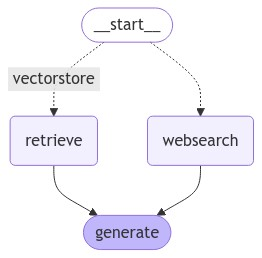

# CustomerSupportBot

This is a repository for a **Customer Support AI Agent** developed using **LangGraph**. The bot is designed to provide automated support for customer queries by either retrieving information from document databases (vectorstores) or performing web searches when needed. The project explores **agentic AI** developments to optimize how questions are routed to the most relevant sources of information.

## Features

- **Document-Based Query Resolution**: The agent retrieves information from a set of indexed documents stored in a vectorstore. This is useful for handling questions related to specific internal knowledge, such as FAQs, product manuals, and technical documents.
  
- **Web Search Integration**: For questions that cannot be answered by internal documents, the agent performs a real-time web search to retrieve relevant information from the web.

## Configuration



- **LLM**: _Llama3-8B-Instruct_


- **Embedding Model**: _BAAI/bge-small-en-v1.5_

- **Vectorstore**: _ChromaDB_

- **Web Search Tool**: _TavilySearch_

## Tools Used

### 1. **Simple RAG**

   - **Workflow**:
     - The user question is embedded using the **BAAI/bge-small-en-v1.5** embedding model.
     - The embedding is matched against a vectorstore of documents to retrieve the most relevant information.
     - The agent uses these documents to generate a response using **Llama3-8B-Instruct**.

### 2. **WEB_SEARCH Tool**
   When the question is outside the knowledge contained in the document vectorstore, the agent falls back on a web search tool.

   - **Workflow**:
     - The question is passed to **TavilySearch**, which performs a web search to find relevant information in real-time.

## Setup

### Prerequisites

Ensure you have the following installed:
- **Python 3.11+** (Prerequisite for smooth development with Langraph)
- **Conda** (recommended for managing environments)

### Clone the Repository

```bash
git clone https://github.com/yourusername/CustomerSupportBot.git
cd CustomerSupportBot
conda env create --name <envname> --file=environment.yml
```

#### Export API KEYS

```bash
export TAVILY_API_KEY="your-api-key-here"
export HF_TOKEN"your-hf-token-here"
```


#### Run the agent
```bash
python3 main.py
```


### Adding New Tools
This repo is currently under developement by me :). You can help me if you want ! 
- Attribution : One of my research thesis
- Hallucination Detection - SelfCheckGPT or NLI based.
- Refer to the LangGraph documentation for more details on how to integrate new tools into the agent.

### Future Work

- Expanding Web Search Capabilities: Adding more sophisticated search mechanisms and processing web data more intelligently.
- Multilingual Support: Enabling the bot to handle customer queries in multiple languages.
- MultiModal Support: Enabling Visual and Speech Inputs 
- Sentiment Analysis Tool: For analyzing the sentiment of customer queries.

